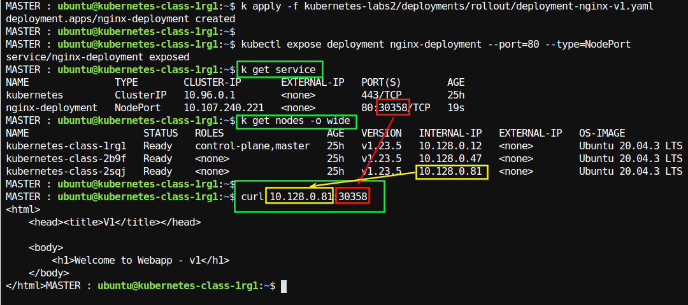
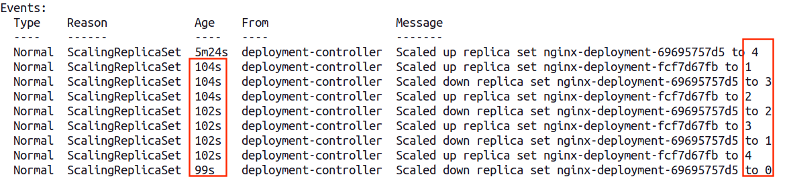

# Lab - Rollout Deployment

## Overview

On this lab, we are going to create a deployment with 4 pods, the image of this deployment is called `nginx-v1` after creating the original deployment, we will `rollout` to update the image
to `nginx-v2`

Notice the difference that when we are updating the image instead of using `apply`, we will use `replace`

## Duration

20 minutes

## Step-1: Fireup a kubernetes cluster

* Start this lab: [Orchestrating the Cloud with Kubernetes](https://www.cloudskillsboost.google/focuses/557?parent=catalog)
* After authorizing the cloud shell, start the cluster

```bash
gcloud auth list
```

```bash
gcloud config set compute/zone us-central1-b
```

```bash
gcloud container clusters create io
```

## Step-2: Deployment file

Inspect  [deployment-rollout-v1.yaml](deployment-rollout-v1.yaml)

## Step-3: Apply Deployment file

Apply the config files using `kubectl -apply` command

```bash
$   kubectl apply -f deployment-rollout-v1.yaml
```

output will look like:

```console
deployment.apps/deployment-rollout-1 created
```

## Step-4: Expose

- expose the deployment

```bash
$ kubectl expose deployment deployment-rollout-1 --port=80 --type=NodePort
```

or if you are running on public cloud

```bash
kubectl expose deployment deployment-rollout-1 --port=80 --type=LoadBalancer
```

output

```console
service/nginx-deployment exposed
```

- get nodeport

```bash
$  kubectl get service
```

output

```console
NAME               TYPE        CLUSTER-IP      EXTERNAL-IP   PORT(S)        AGE
kubernetes         ClusterIP   10.96.0.1       <none>        443/TCP        6m12s
nginx-deployment   NodePort    10.107.20.175   <none>        80:30358/TCP   54s
```

Our nodeport is : **30358**

Find the worker1's IP address and access it.  

```bash
$   kubectl get nodes -o wide
```

Sample output

```console

MASTER : ubuntu@kubernetes-class-1rg1:~$ k get nodes -o wide
NAME                    STATUS   ROLES                  AGE   VERSION   INTERNAL-IP   
kubernetes-class-1rg1   Ready    control-plane,master   24h   v1.23.5   10.128.0.12  
kubernetes-class-2b9f   Ready    <none>                 24h   v1.23.5   10.128.0.47  
kubernetes-class-2sqj   Ready    <none>                 24h   v1.23.5   10.128.0.81  
```

So if the worker's IP is 10.128.0.81    and NodPort is 30358

```bash
# substitute 10.128.0.81   with your worker node IP
# substitute 32073 with your service NodePort port
$   curl   10.128.0.81:30358/
```

output will look like:

```console
Welcome to Webapp - v1
```

See this screencapture to understand the 'wiring'



## Step-5: rollout an update

**Note:** Read the entire section before starting the rollout process.

**Note:** monitor the results as soon as possible. it will be fast.

Inspect v2  : [deployment-rollout-v2.yaml](deployment-rollout-v2.yaml)

use the `v2` to update nginx from v1 to v2

```bash
$   kubectl replace  -f deployment-rollout-v2.yaml
```

Notice that instead of `apply` we are using `replace`.

Monitor the status of rollout using the following command:

```bash
$  kubectl rollout status deployment deployment-rollout-2
```

Note the events section at the end of output.  It will look like:



**Note the following**

- Look at how new Pods are being created in new replica-set,  while pods are being removed from old-replica-set
- Also look at how much time has elapsed since the rollout began (104  - 99 = 5 seconds)

## Step-6: verify

Verify if the new rolled out service

```bash
# substitute 1.2.3.4 with your worker node IP
# substitute 32073 with your service NodePort port
$   curl   1.2.3.4:32073/
```

```console
Welcome to Webapp - v2
```

## Step-7: Now roll back

Oops, let's pretend something went wrong with v2 deploymnet.

Please roll back to v1 😅

## Lab is Complete! 👏
