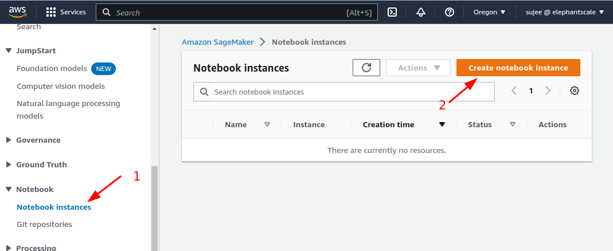

# Hosted Jupyter Environments in the Cloud

## Overview

Using hosted Jupyter notebook environments in the cloud

## References

* [Six easy ways to run your Jupyter Notebook in the cloud](https://www.dataschool.io/cloud-services-for-jupyter-notebook/)
* [Choosing the Right JupyterHub Infrastructure](https://data.berkeley.edu/choosing-right-jupyterhub-infrastructure)

---

## GOOGLE-0: ML on Google Cloud

* [Introduction to Vertex AI](https://cloud.google.com/vertex-ai/docs/start/introduction-unified-platform)
* [Vertex AI docs](https://cloud.google.com/vertex-ai/docs)

---

## GOOGLE-1: Testing Colab

* Run a test Jupyter notebook on Google COLAB
* Runtime: 10 mins
* Prerequisites:
    * Colab is free to use.  You will need a Google account;  login using your Google account
* Go to [colab.research.google.com](https://colab.research.google.com/)
* Open `testing-123.ipynb`
    * Select **File --> Upload Notebook** and select `testing-123` notebook
    * or Select **File --> Open Notebook --> Github**
* Paste the following URL :  
`https://github.com/elephantscale/internet2-cloud-course-v2/tree/main/labs/08-ml/testing-123.ipynb`
* Run the notebook and make sure there are no errors!

---

## GOOGLE-2: Python Scikit-Learn on  Colab

* Run a Jupyter notebook on Google COLAB
* Runtime: 20 mins
* Prerequisites:
    * Colab is free to use.  You will need a Google account;  login using your Google account
* [Code repo is here](https://github.com/elephantscale/machine-learning-workshop)
* Go to [colab.research.google.com](https://colab.research.google.com/)
* Select **File --> Open Notebook --> Github**
* Paste the following URL :  
`https://github.com/elephantscale/machine-learning-workshop/blob/main/regressions/lr-2-house-prices.ipynb`
* This will open the notebook in 'read-only' mode.  Choose `File --> Save a copy in Drive` option to save it in your workspace.  
    - This will create your own copy of notebook and reopen that.  Keep this tab open.  
    - Close other other one.
* Work through the example.  You can consult the [solution file](https://github.com/elephantscale/machine-learning-workshop/blob/main/regressions/solutions/lr-2-house-prices.ipynb)
* **Team competition:  Work as teams.  Try to get the highest R2 with the fewest attributes?  Demo your work to the class**

---

## AWS-0: Jupyter on AWS

* [Amazon SageMaker Notebooks](https://aws.amazon.com/sagemaker/notebooks/)
* [Amazon SageMaker Notebook Instances documentation](https://docs.aws.amazon.com/sagemaker/latest/dg/nbi.html)

---

## AWS-1: Running Jypyter Notebook on AWS

* We will run a test Jupyter notebook on Amazon Sagemaker
* Runtime: 10 mins
* Prerequisites:
    * You will need an AWS/Sagemaker account (not qwiklabs)
* Login to [AWS Sagemaker](https://us-west-2.console.aws.amazon.com/sagemaker/home?region=us-west-2#/getting-started) console - Choose your region
* Select **Notebooks -> Create Notebook** (see screenshot below)
* Once notebook env is created, **open jupyter lab**
* Upload **testing-123.ipynb** notebook and run it.  Make sure there are no errors.
* Upload **testing-123-sagemaker.ipynb** notebook and run it.  Make sure there are no errors.

---

## AWS-2: Running a Notebook on Sagemaker

* Run a simple regression notebook on Sagemaker
* Runtime: 15 mins
* Download [Notebook code](https://github.com/elephantscale/machine-learning-workshop/blob/main/regressions/lr-2-house-prices.ipynb) and upload it to Sagemaker
* And run it
* [Solution file](https://github.com/elephantscale/machine-learning-workshop/blob/main/regressions/solutions/lr-2-house-prices.ipynb)

---

## AZURE-00: Azure ML

* [Azure ML Overview](https://azure.microsoft.com/en-us/products/machine-learning/)

---

## AZURE-01: Getting Started with Azure ML

* Prepare Azure ML environment
* Runtime: 1 hr
* Instructions: [Quickstart: Create workspace resources you need to get started with Azure Machine Learning](https://learn.microsoft.com/en-us/azure/machine-learning/quickstart-create-resources)

---

## AZURE-02: Run a Jupyter Notebook on Azure Studio

* Runtime: 30 mins
* Instructions: [Quickstart: Run Jupyter notebooks in studio](https://learn.microsoft.com/en-us/azure/machine-learning/quickstart-run-notebooks)

---

