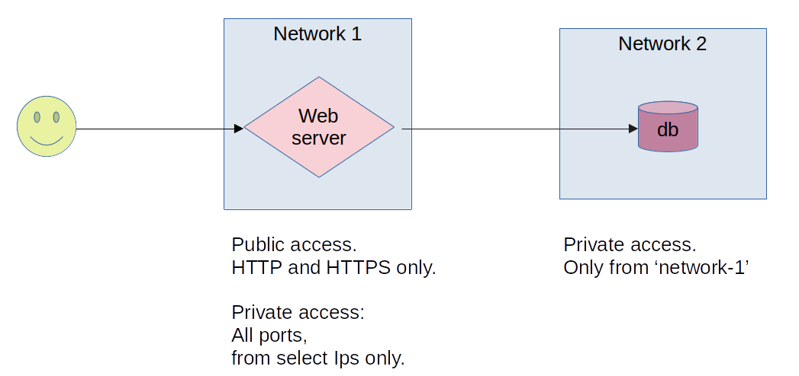

# Practice Lab: Build a Web Stack with Networking Rules

In this lab, we are going to design a very simple web application stack along with network policies.

Here is the architecture:

* To implement this, you can pick a cloud of your choice.
* You can accomplish this with 1 VPC + 2 subnets
* You will create 2 networks; a public one for webserver and a private one for database
* 'network-1' that hosts webserver will allow incoming HTTP/HTTPS traffic from any IP address (0.0.0.0/0)
* 'network-1' will also allow all traffic from a few selected IP address (these could be dev machines where we login from to do maintanance work)
* 'network-2' that hosts database, will only allow traffic from 'network-1'

Shortcuts:

* You don't need to run an actual database or webapp on these machines.  Just spin up two VMs and check access

Verification:

* You will verify this by accessing webserver - you should see a sample web page
* When you try to access DB from a public IP, it will be blocked
* When you try to SSH into webserver from a public IP, it will be blocked, unless it the IP is explicitly authorized to connect

---
